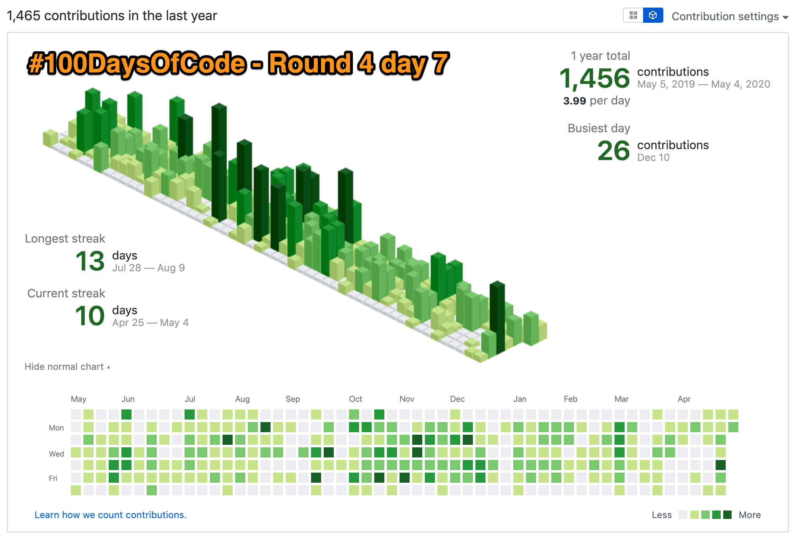
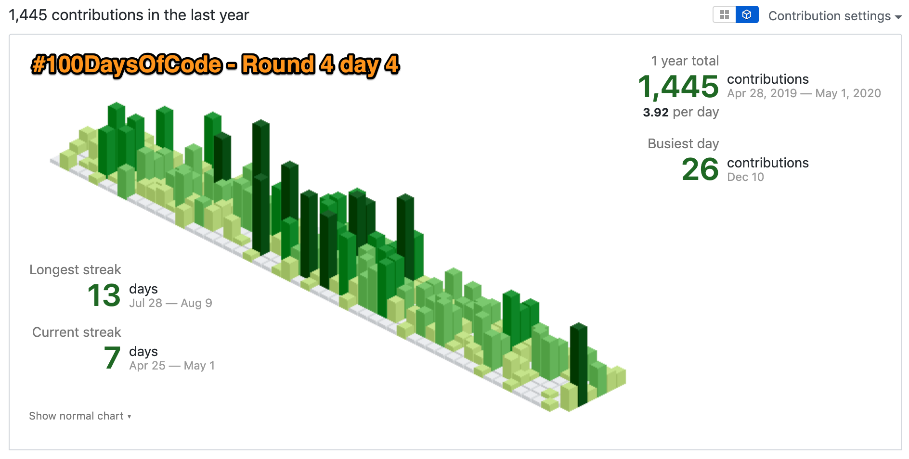
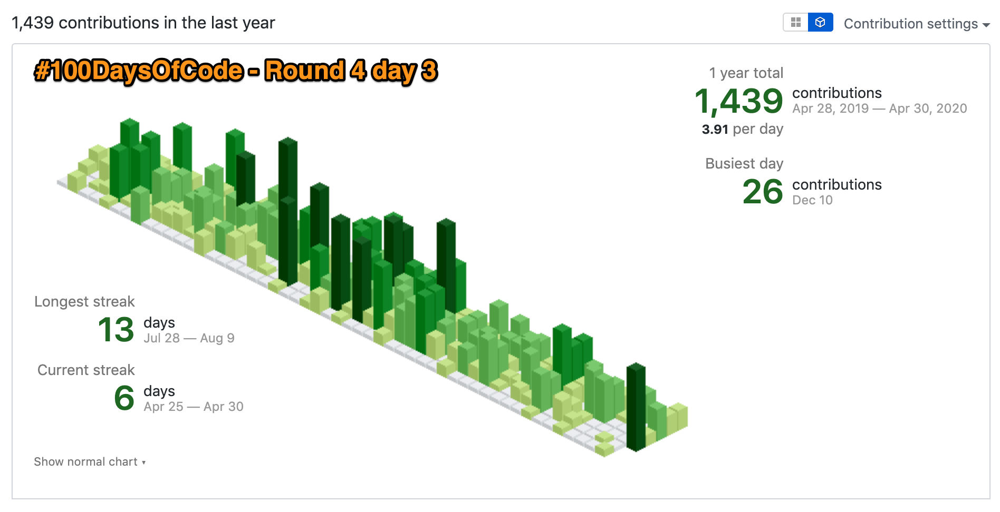
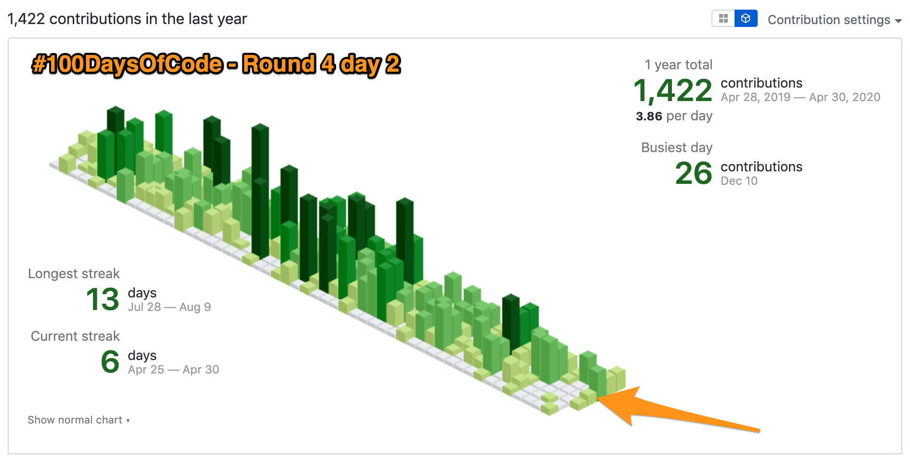
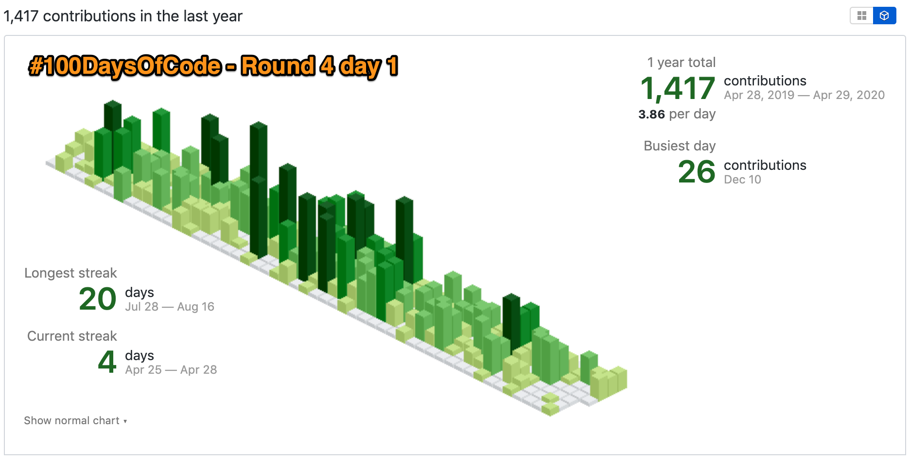

# 100-days-log
The log of [my 100 Days Of Code](https://medium.freecodecamp.org/join-the-100daysofcode-556ddb4579e4)


<!-- START doctoc generated TOC please keep comment here to allow auto update -->
<!-- DON'T EDIT THIS SECTION, INSTEAD RE-RUN doctoc TO UPDATE -->
**Table of Contents**  *generated with [DocToc](https://github.com/thlorenz/doctoc)*

- [Round 4](#round-4)
  - [2020-05-28 day 031](#2020-05-28-day-031)
  - [2020-05-27 day 030](#2020-05-27-day-030)
  - [2020-05-26 day 029](#2020-05-26-day-029)
  - [2020-05-25 day 028](#2020-05-25-day-028)
  - [2020-05-24 day 027](#2020-05-24-day-027)
  - [2020-05-23 day 026](#2020-05-23-day-026)
  - [2020-05-22 day 025](#2020-05-22-day-025)
  - [2020-05-21 day 024](#2020-05-21-day-024)
  - [2020-05-20 day 023](#2020-05-20-day-023)
  - [2020-05-19 day 022](#2020-05-19-day-022)
  - [2020-05-18 day 021](#2020-05-18-day-021)
  - [2020-05-17 day 020](#2020-05-17-day-020)
  - [2020-05-16 day 019](#2020-05-16-day-019)
  - [2020-05-15 day 018](#2020-05-15-day-018)
  - [2020-05-14 day 017](#2020-05-14-day-017)
  - [2020-05-13 day 016](#2020-05-13-day-016)
  - [2020-05-12 day 015](#2020-05-12-day-015)
  - [2020-05-11 day 014](#2020-05-11-day-014)
  - [2020-05-10 day 013](#2020-05-10-day-013)
  - [2020-05-09 day 012](#2020-05-09-day-012)
  - [2020-05-08 day 011](#2020-05-08-day-011)
  - [2020-05-07 day 010](#2020-05-07-day-010)
  - [2020-05-06 day 009](#2020-05-06-day-009)
  - [2020-05-05 day 008](#2020-05-05-day-008)
  - [2020-05-04 day 007](#2020-05-04-day-007)
  - [2020-05-03 day 006](#2020-05-03-day-006)
  - [2020-05-02 day 005](#2020-05-02-day-005)
  - [2020-05-01 day 004](#2020-05-01-day-004)
  - [2020-04-30 day 003](#2020-04-30-day-003)
  - [2020-04-29 day 002](#2020-04-29-day-002)
  - [2020-04-28 day 001](#2020-04-28-day-001)
- [Round 3](#round-3)
- [Round 2](#round-2)
- [Round 1](#round-1)
- [2018-06-17 Initial commit](#2018-06-17-initial-commit)
- [Author](#author)

<!-- END doctoc generated TOC please keep comment here to allow auto update -->
## Round 4

This time, during SARS-COV-2 Pandemic, I decided to take on this challenge again. This time, commit in private repositories also count.

### 2020-05-28 day 031

Today I worked on [css_drawings](https://github.com/mauriciovieira/css_drawings) project.

### 2020-05-27 day 030

Today I worked on [css_drawings](https://github.com/mauriciovieira/css_drawings) project.

### 2020-05-26 day 029

Today I worked on [css_drawings](https://github.com/mauriciovieira/css_drawings) project.

### 2020-05-25 day 028

Today I worked on [css_drawings](https://github.com/mauriciovieira/css_drawings) project.

### 2020-05-24 day 027

Today I worked on [mauxmusic](https://github.com/mauriciovieira/mauxmusic) project, and started [css_drawings](https://github.com/mauriciovieira/css_drawings) project.

### 2020-05-23 day 026

Today I worked on [mauxmusic](https://github.com/mauriciovieira/mauxmusic) project.

### 2020-05-22 day 025

I continued to [learn more about deno](htttps://github.com/mauriciovieira/learning-deno).

Readings:
- https://medium.com/developers-writing/write-code-every-day-aab8c7c192f5

### 2020-05-21 day 024

I continued to [learn more about deno](htttps://github.com/mauriciovieira/learning-deno).

### 2020-05-20 day 023

I continued to [learn more about deno](htttps://github.com/mauriciovieira/learning-deno).

### 2020-05-19 day 022

I continued to [learn more about deno](htttps://github.com/mauriciovieira/learning-deno).

Readings:
- https://medium.com/netscape/fun-with-typescript-string-interpolation-lambda-functions-the-function-invocation-operator-55e21bf055c6

### 2020-05-18 day 021

I continued to [learn more about deno](htttps://github.com/mauriciovieira/learning-deno).

### 2020-05-17 day 020

Today I [installed](https://github.com/mauriciovieira/eiitp) [deno](https://deno.land/manual) and [gave it a try](htttps://github.com/mauriciovieira/learning-deno).

### 2020-05-16 day 019

Today I worked on [mauxmusic](https://github.com/mauriciovieira/mauxmusic) project.

### 2020-05-15 day 018

Today I worked on [mauxmusic](https://github.com/mauriciovieira/mauxmusic) project.

### 2020-05-14 day 017

Today I worked on [mauxmusic](https://github.com/mauriciovieira/mauxmusic) project.

### 2020-05-13 day 016

Today I worked on [mauxmusic](https://github.com/mauriciovieira/mauxmusic) project.

### 2020-05-12 day 015

Today I worked on [mauxmusic](https://github.com/mauriciovieira/mauxmusic) project. I changed [eiitp](https://github.com/mauriciovieira/eiitp) a bit:
- created an alias for [omnistart_rails](https://github.com/OmnicodeSolutions/omnistart_rails/blob/master/template.rb) locally
- installed [postman](https://www.postman.com/) for an investigation
- upgrade ruby using asdf and added a new directory to path.

### 2020-05-11 day 014

Today I worked on [mauxmusic](https://github.com/mauriciovieira/mauxmusic) project.

### 2020-05-10 day 013

Today I worked on [mauxmusic](https://github.com/mauriciovieira/mauxmusic) project.

Readings:
- https://andycroll.com/ruby/choose-uuids-for-model-ids-in-rails/

### 2020-05-09 day 012

Today I worked on [mauxmusic](https://github.com/mauriciovieira/mauxmusic) project.

### 2020-05-08 day 011

Today I worked on [mauxmusic](https://github.com/mauriciovieira/mauxmusic) project.

### 2020-05-07 day 010

Worked on [omnistart_rails](https://github.com/OmnicodeSolutions/omnistart_rails/blob/master/template.rb) and began another POC in rails.

### 2020-05-06 day 009

Worked on exercism and a bit of rails

### 2020-05-05 day 008

Added system tests to the rails+react secret project.

### 2020-05-04 day 007

**May the fourth be with you**

Today I worked on [mauxmusic](https://github.com/mauriciovieira/mauxmusic) project and started a rails api-only project.



### 2020-05-03 day 006

Today is my birthday. Another single commit in the rails+react secret project (so far).

### 2020-05-02 day 005

Single commit in a personal project. Rails+react. I don't intend to release it open unless I make it more beautiful, with tests on backend and frontend.

### 2020-05-01 day 004

Some work on eiitp, and [an exercism solution](https://github.com/mauriciovieira/exercism-tracks/commit/58116d8d8dc0da214ace4b0618f5b217425c580c)



### 2020-04-30 day 003

I finished configuring asdf locally with [everybody is in the place](https://github.com/mauriciovieira/eiitp/commits?author=mauriciovieira&since=2020-04-30&until=2020-04-30). Then I filed a [Bug Report](https://github.com/asdf-vm/asdf/issues/718) to asdf and proposed a [fix for it](https://github.com/asdf-vm/asdf/issues/719).
I decided to make some security upgrades for some repositories and deployed [one of them](https://github.com/mauriciovieira/make-a-drink) to [heroku](https://mauriciovieira-make-a-drink.herokuapp.com/).

Readings:
- https://github.com/marmelab/awesome-rest that led me to https://github.com/PostgREST/postgrest, a RESTful API server for any postgresql database written in Haskell.
- https://github.com/rodrigondec/drf-api-domain/blob/master/Makefile -> https://phalt.github.io/django-api-domains/



### 2020-04-29 day 002

I didn't log here in time. I was still working in ansible, trying to make [asdf](https://asdf-vm.com/) to work. I found an [ansible role](https://github.com/markosamuli/ansible-asdf) and made it work here.

Readings:
- https://docs.ansible.com/ansible/latest/galaxy/user_guide.html#finding-collections-on-galaxy
- https://galaxy.ansible.com/markosamuli/asdf
- https://docs.ansible.com/ansible/latest/user_guide/playbooks_reuse_roles.html



### 2020-04-28 day 001

I have been practicing rails. Since something is broken with my asdf installation, I need to work on my ansible repo [eiitp](https://github.com/mauriciovieira/eiitp).

Readings:
- https://docs.python-guide.org/dev/virtualenvs/
- https://docs.ansible.com/ansible/latest/user_guide/playbooks_loops.html#id5
- https://stackoverflow.com/questions/23945201/how-to-run-only-one-task-in-ansible-playbook



## Round 3

[Third attempt](ROUND3.md)

## Round 2

[Second attempt](ROUND2.md)

## Round 1

[First attempt](ROUND1.md)

## 2018-06-17 Initial commit

A few days ago, I read a [blog post](https://www.codingame.com/blog/100-days-of-code-challenge/) about the #100DaysOfCode challenge and decided to try it.

That means I'll have to code for 1 hour everyday until 25th of September, according to the [rules](https://github.com/kallaway/100-days-of-code/blob/master/rules.md):

```bash
$ python -c 'import datetime; print((datetime.datetime.today()+datetime.timedelta(100)).strftime("%F"))'
2018-09-25
```

I'll also try to take a screenshot[1] of my contributions[2], every day. Today, before creating this repository, the situation was


In my wishlist there are the following tasks:

* Remake of my [personal website](https://mauriciovieira.net), unify the blogs that I have in it.
  * Recover my oldest notes and troubleshooting and post there.
* Finish older projects like
  * Nnb Spotify wraper in ES7
  * Nnb YouTube player in ES7
  * Nnb BigFuture in Django
  * Nnb MyWonderland in Django+React
* Become fluent in React+Redux
* Become fluent in golang by working on [exercism challenges](https://github.com/mauriciovieira/exercism-tracks)
* And maybe some other digressions (like Haskell, Elm, old ideas)

Notes: <br />
[1] Using [skitch](https://github.com/mauriciovieira/eiitp/commit/d24825654191aee096c27297ba694f5a56866388)<br />
[2] Using [isometric-contributions](https://github.com/jasonlong/isometric-contributions)

## Author

| |
|:---------------------:|
|  [Mauricio Vieira](https://github.com/mauriciovieira/)   |

+ <https://mauriciovieira.net>
+ <https://twitter.com/mauriciovieira>
